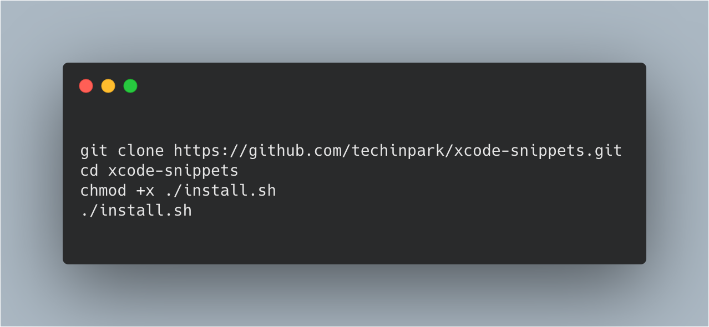

# xcode-snippets 


ios 개발시 유용한 snippet 들을 모아놓은 repository 입니다. 


### Usage 



## Snippets List :memo:

#### A. Rx+Snippets 🚀
 ##### `RxSwift` 와 함께 사용하면 유용한 `Snippet` 모음입니다. 

### 01. subscribe(onNext)

 |파일명|[5B5A1A4C-9F15-42EB-8286-6638A54AA449.codesnippet](./5B5A1A4C-9F15-42EB-8286-6638A54AA449.codesnippet)|
 |--|--|
 |단축어|`_subscribeOnNext`|
 
 
```swift
.subscribe(onNext: {[weak self] _ in
                guard let self = self else { return }
                
            })
            .disposed(by: self.disposeBag)
```
#### B. UI+Snippets 🚀
 ##### `UI` 개발시 사용하면 유용한 `Snippet` 모음입니다. 

### 01. Appearance Settings 

|파일명|[9E617093-720D-4DF9-8D40-E6D4E4695A36.codesnippet](./9E617093-720D-4DF9-8D40-E6D4E4695A36.codesnippet)|
 |--|--|
 |단축어|`_appearanceSettings`|
 
```swift
private struct Metric {
        
}
    
private struct Font {
        
}
    
private struct Color {
        
}
```
